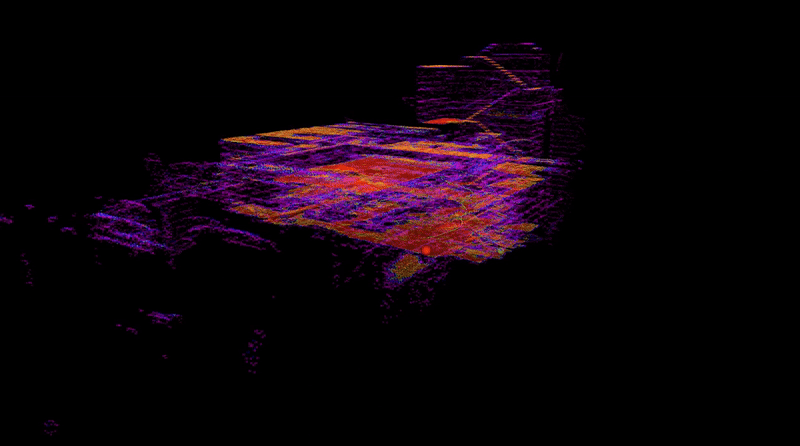

# PCT Planner

A ROS 2 implementation of **Efficient Global Navigational Planning in 3-D Structures Based on Point Cloud Tomography** (IEEE pedestrian on Mechatronics).

PCT Planner provides highly efficient global navigation for ground robots in multi-layer 3D structures such as parking garages, multi-story buildings, and complex outdoor environments with overhangs.



**Paper & Demos**: [pct_planner](https://byangw.github.io/projects/tmech2024/)


## Prerequisites

- **Ubuntu 24.04** with **ROS 2 Jazzy**
- **CUDA >= 11.7** for GPU-accelerated tomogram processing
- **Python >= 3.10**

### Python Dependencies

```bash
pip3 install cupy-cuda11x open3d numpy
```

## Build

### 1. Build the Planner C++ Module

```bash
cd pct_planner/planner/
./build_thirdparty.sh  # First time only
./build.sh
```

### 2. Build the ROS 2 Package

```bash
colcon build --symlink-install --cmake-args -DCMAKE_BUILD_TYPE=Release --packages-select pct_planner
source install/setup.bash
```

## Operating Modes

PCT Planner supports two operating modes:

### SLAM Mode

Build tomograms on-demand from live point cloud data. Call the `/build_tomogram` service to capture the current map and generate a tomogram.

```bash
ros2 launch pct_planner pct_planner.launch.py local_mode:=false
```

```bash
# Trigger tomogram build from /explored_areas topic
ros2 service call /build_tomogram std_srvs/srv/Trigger
```

### Relocalization Mode

Load a pre-built tomogram for navigation in known environments. Faster startup and more efficient for repeated navigation.

```bash
ros2 launch pct_planner pct_planner.launch.py local_mode:=true tomogram_path:=/path/to/map_tomogram.pickle
```

## Tools

### PCT Visualizer

Interactive visualization tool for offline tomogram analysis and path planning testing.

```bash
ros2 launch pct_planner pct_visualizer.launch.py pcd_file:=/path/to/map.pcd
```

Use the **Publish Point** tool in RViz to set start (1st click) and goal (2nd click) positions.


### PCD to Tomogram Converter

Convert PCD files to tomogram pickle files for relocalization mode.

```bash
# From PCD file
ros2 run pct_planner pcd_to_tomogram.py map.pcd -o map_tomogram.pickle

# From ROS 2 topic (waits for single message)
ros2 run pct_planner pcd_to_tomogram.py -t /explored_areas -o map_tomogram.pickle
```

## Package Structure

```
pct_planner/
├── planner/           # C++ path planning and trajectory optimization
│   ├── lib/           # A* search, GPMP optimizer, elevation planner
│   └── scripts/       # Python wrappers
├── tomography/        # GPU-accelerated point cloud tomography
│   └── scripts/       # Tomogram generation and visualization
├── scripts/           # ROS 2 nodes
│   ├── pct_planner_node.py       # Main planner node
│   ├── pct_planner_visualizer.py # Interactive visualizer
│   └── pcd_to_tomogram.py        # Conversion utility
├── utils/             # Goal validation and path utilities
└── config/            # Parameter files
```

## Configuration

Parameters are configured via `config/pct_planner_params.yaml` or launch file arguments. Key parameters include tomogram resolution, slope limits, and waypoint lookahead distance.

## License

Released under [GPLv2](http://www.gnu.org/licenses/) license.


## Citing

```bibtex
@ARTICLE{yang2024efficient,
  author={Yang, Bowen and Cheng, Jie and Xue, Bohuan and Jiao, Jianhao and Liu, Ming},
  journal={IEEE/ASME Transactions on Mechatronics},
  title={Efficient Global Navigational Planning in 3-D Structures Based on Point Cloud Tomography},
  year={2024},
  pages={1-12}
}
```
